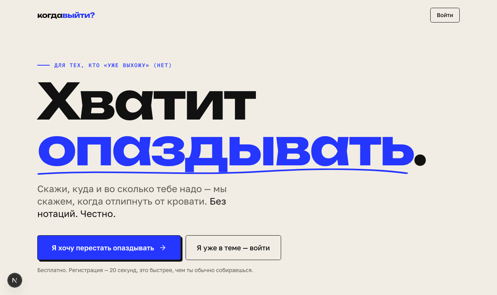
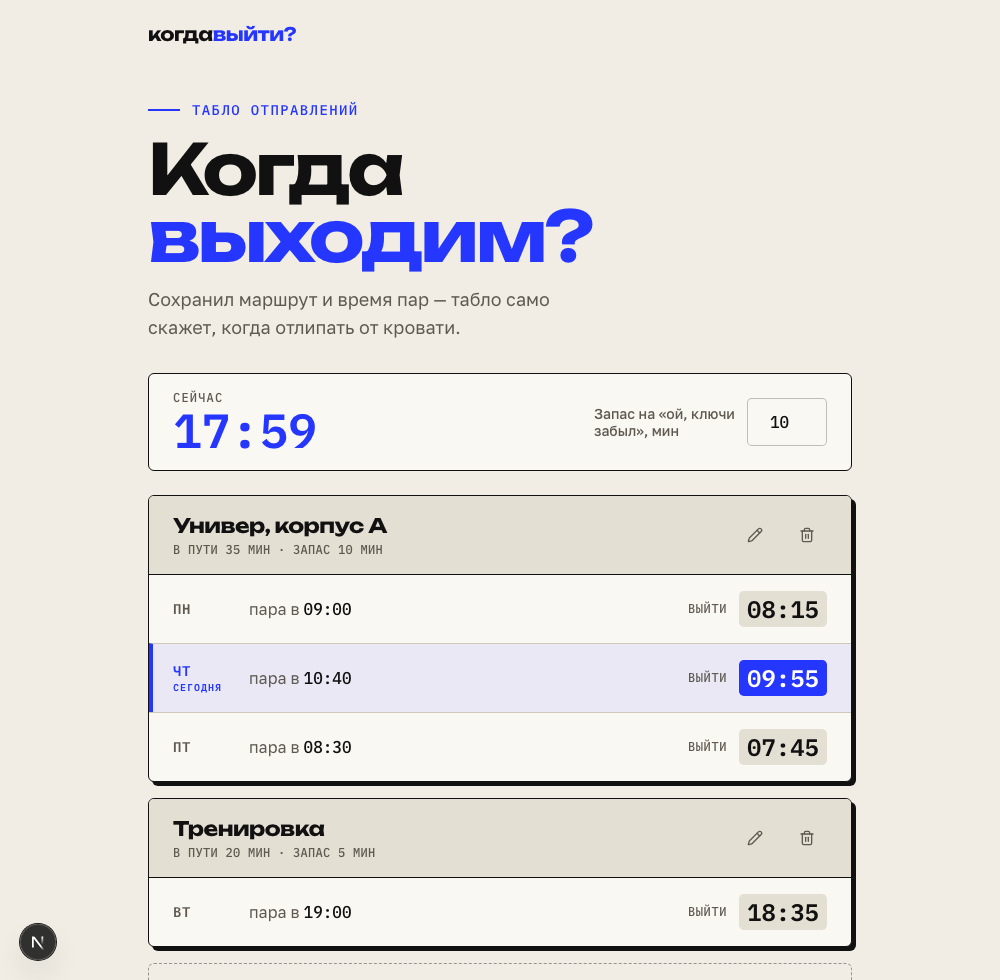

# Когда выйти?

Ты знаешь, во сколько тебе надо быть на месте. Ты не знаешь, во сколько для этого
выходить. «Когда выйти?» — сохранённые маршруты и расписание, а табло само каждый
раз считает время выхода:

```
выйти = время начала − запас на «ой, ключи забыл» − время в пути
```



<table>
<tr>
<td width="50%">

**Вход** — только почта и пароль, без магических ссылок.


</td>
<td width="50%">

**Главный экран** — маршруты как табло отправлений, сегодняшняя строка подсвечена.



</td>
</tr>
</table>

## Стек

Next.js · TypeScript · Tailwind CSS · shadcn/ui · Supabase (база данных и вход) · pnpm

## Запуск

```bash
pnpm install
cp .env.example .env.local   # и впишите ключи Supabase — Project Settings → API
pnpm dev                     # http://localhost:3000
```

Схема базы данных — в `supabase/migrations/`, накатывается через Supabase CLI или MCP.

Проверки перед коммитом:

```bash
pnpm lint
pnpm exec tsc --noEmit
```

## Структура проекта

```
app/            страницы: лендинг, вход/регистрация, главный экран
components/     форма маршрута, табло, общие стили
lib/            расчёт времени выхода, хранение данных в Supabase
supabase/       схема базы данных
```
